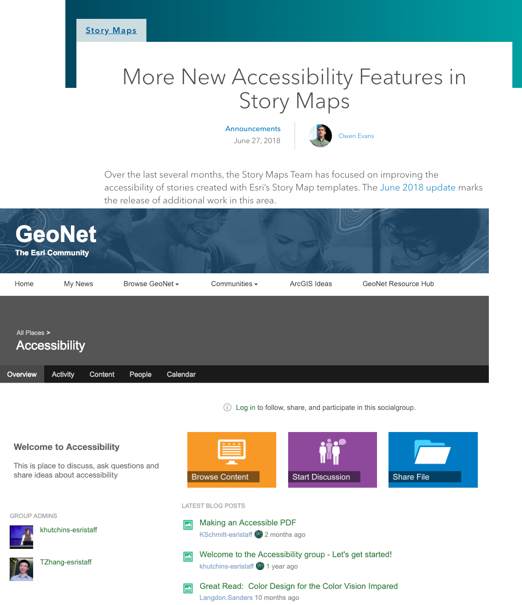
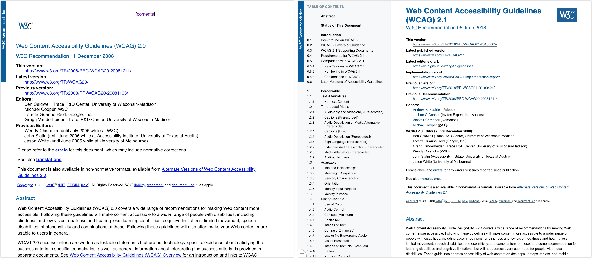
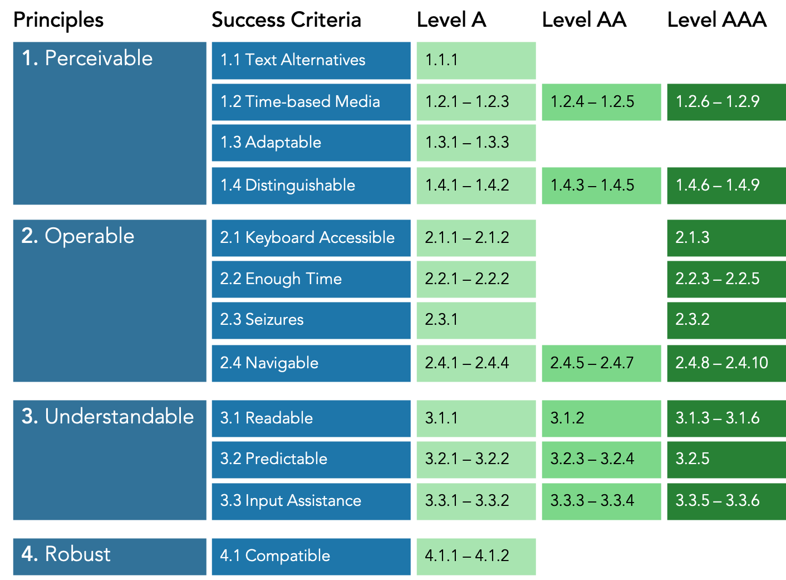
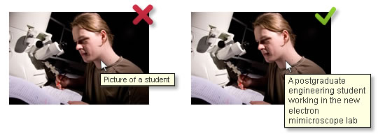
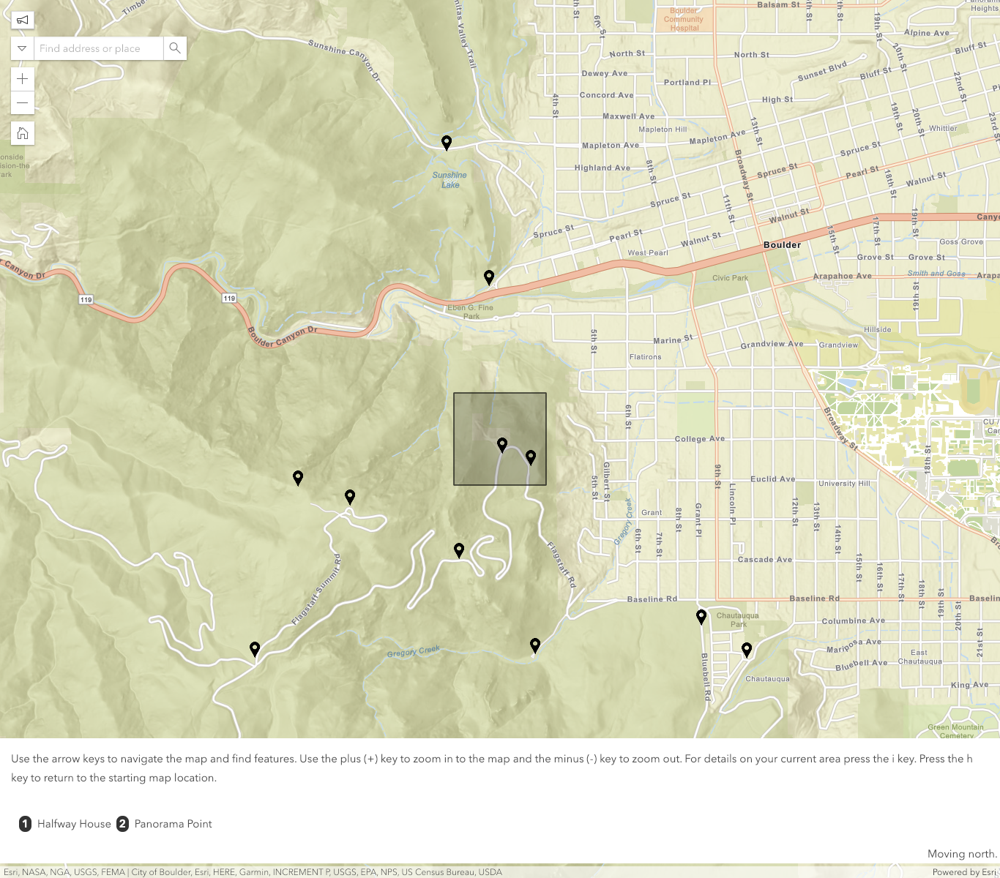

<!-- .slide: data-background="/images/background/00.svg" -->

# Web Accessibility Best Practices

    Kelly Hutchins 
    Tao Zhang

Jan 23, 2019 · Esri GeoDev Webinar

---
<!-- .slide: data-background="/images/background/01.svg" -->

## What is accessibility?

- Make content usable for everyone regardless of abilities
- 15% of world population lives with some form of disability
- In the US, 1 in 5 adults has a disability
- Disabilities could be temporary or situational

---
<!-- .slide: data-background="/images/background/01.svg" -->

## Why is accessibility important?

- The ADA and Section 508
- People with different abilities should have equal access to the web
- Good accessibility is good user experience

---
<!-- .slide: data-background="/images/background/01.svg" -->

<h2 class="twocoltitle">How is Esri doing?</h2>

    <ul class="leftcol">
        <li>Reviewing products internally for compliance</li>
        <li>Fixing accessibility issues</li>
        <li>Working accessibility into new features</li>
        <li>Sharing knowledge and best practices</li>
    </ul>
    

---
<!-- .slide: data-background="/images/background/01.svg" -->

<h2 class="twocoltitle">WCAG</h2>

Web Content Accessibility Guidelines

---
<!-- .slide: data-background="/images/background/01.svg" -->

    

---
<!-- .slide: data-background="/images/background/01.svg" -->

<h2 class="centertitle">Overview of WCAG 2.0</h2>

    

---
<!-- .slide: data-background="/images/background/01.svg" -->

## What we will cover today

- Focus and tab order
- Color and color contrast
- Text alternatives
- Map for non-sighted users
- A DIY accessibility test process

---
<!-- .slide: data-background="/images/background/01.svg" -->

## Focus and tab order

<ul>
    <li class="fragment"><a href="https://www.w3.org/TR/UNDERSTANDING-WCAG20/navigation-mechanisms-focus-visible.html">WCAG 2.4.7</a>: Interactive elements should have clear focus.</li>
    <li class="fragment"><a href="https://www.w3.org/TR/UNDERSTANDING-WCAG20/content-structure-separation-sequence.html">WCAG 1.3.2</a>: Navigation (tab) order should be logical and intuitive.</li>
    <li class="fragment"><a href="https://www.w3.org/TR/UNDERSTANDING-WCAG20/keyboard-operation-keyboard-operable.html">WCAG 2.1.1</a>: Keyboard users should be able to use functionalities using keyboard only.</li>
    <li class="fragment"><a href="http://www.w3.org/TR/UNDERSTANDING-WCAG20/keyboard-operation-trapping.html">WCAG 2.1.2</a>: Content does not "trap" keyboard focus within subsections.</li>
</ul>

---
<!-- .slide: data-background="/images/background/01.svg" -->

    <a href="#">Demo: Focus and tab order</a>

---
<!-- .slide: data-background="/images/background/01.svg" -->

## Test focus and tab order

- Tab through page to verify all interactive elements have focus
- Focus order matches intended reading order
- Interact with all links and controls using only keyboard
- No keyboard trap exist except for modals
- Off-screen/invisible content does not receive focus

---
<!-- .slide: data-background="/images/background/01.svg" -->

## Color and color contrast

<ul>
    <li class="fragment"><a href="http://www.w3.org/TR/UNDERSTANDING-WCAG20/visual-audio-contrast-without-color.html">WCAG 1.4.1</a>: Color is not the only visual means of conveying information.</li>
    <li class="fragment"><a href="http://www.w3.org/TR/UNDERSTANDING-WCAG20/visual-audio-contrast-contrast.html">WCAG 1.4.3</a>: Text needs to have contrast ratio of at least 4.5:1.</li>
</ul>

---
<!-- .slide: data-background="/images/background/01.svg" -->

    <a href="#">Demo: Color and color contrast</a>

---
<!-- .slide: data-background="/images/background/01.svg" -->

## Test color and color contrast

- Look for content differentiated by color only
- Use a [contrast ratio calculator](https://contrast-ratio.com/)
- Review color contrast issues reported by automated test tool ([aXe](https://chrome.google.com/webstore/detail/axe/lhdoppojpmngadmnindnejefpokejbdd))

---
<!-- .slide: data-background="/images/background/01.svg" -->

<h2 class="twocoltitle">Text alternatives</h2>

    <a href="https://www.w3.org/TR/UNDERSTANDING-WCAG20/text-equiv-all.html">WCAG 1.1.1</a>: Non-text content has text alternative.

    If image is decorative, use `alt=""`.

---
<!-- .slide: data-background="/images/background/01.svg" -->

    <a href="#">Demo: Text alternative</a>

---
<!-- .slide: data-background="/images/background/01.svg" -->

## Write effective alternate text

- Think about how users will be doing with the information
- Be accurate in presenting the content in images
- Be succinct
- No need to use the phrase "image of ..." to describe images

---
<!-- .slide: data-background="/images/background/01.svg" -->

<h2 class="centertitle">Alt text example</h2>

    

    Source: https://www2.le.ac.uk/webcentre/plone/build/basics/add-images/alt-text

---
<!-- .slide: data-background="/images/background/01.svg" -->

<h2 class="centertitle">Map for non-sighted users</h2>

    

<a href="https://github.com/Esri/a11y-map">https://github.com/Esri/a11y-map</a>

---
<!-- .slide: data-background="/images/background/01.svg" -->

<video controls>
    <source src="images/a11y-map-demo.mp4"  type="video/mp4">
</video>

<a href="https://github.com/Esri/a11y-map">https://github.com/Esri/a11y-map</a>

---
<!-- .slide: data-background="/images/background/02.svg" -->

### Questions?

Slides: 
